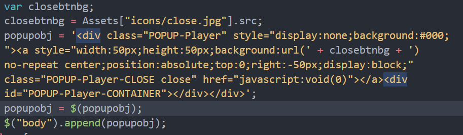

# 用Foliou开发组件

## 用Foliou开发组件的优势

* 支持在js中require css/scss/less文件
* 支持js中 require html文件
* 支持在 html 以相对路径引入图片
* 支持在css 中以相对路径引入图片
* 快速开发演示示例
* 一键打包
* 一键发布
* 支持导出requirejs组件

## 需求是什么

我们工作的内容大部分是游戏相关的活动专题或者游戏的官网例如

[http://zt2m.ztgame.com/](http://zt2m.ztgame.com/)  
[http://jl2.ztgame.com/](http://jl2.ztgame.com/)

有很多类似的功能可以开发成组件的形式比如说 轮播图，视频播放器等等，我想要把这些功能开发完成后发布到npm上，这样以后使用的过程中就可以这样写了。

```javascript
//foliou 是我的组件集的名称，已经发布到了 npm
var player = require("foliou/player");
new player("video_wrap",{
    file:'......'
});
```

拿视频播放器组件来说，组件的逻辑无非就是在页面中插入一些html，这些html具有有默认的样式，而且还有一些按钮图片。

但是在开发的过程中我遇到了一些困惑。

### 1.用js插入HTML

最开始我是这样做的，直接在js中写html的字符串，然后把它插入到对应的容器中



在HTML代码量很少的时候这样做貌似没有什么问题，就是丑了点，我相信有些对代码要求干净的人，已经忍不下去了，

那有没有更好的办法呢，是否能HTML写在.html中，在js中直接引入呢，如下：



```markup
<div class="POPUP-Player">
    ......
</div>
```




```javascript
var html = require("./tpl.html");
```


### 解决方案——Rollup

我相信很多人知道这工具，如果不知道也没有关系，它就是一个 打包js的工具，就像webpack，Browserify，当然他们有所不同。

我选择Rollup 的原因：

1. 兼容性
2. 轻量但功能够用
3. 口碑还不错

Rollup的使用方法有两种

```text
使用之前需要安装rollup
```

```bash
npm install rollup -g
```

1. 命令行

```bash
rollup main.js --file bundle.js --format cjs
```

1. Javascript Api


```javascript
const rollup = require('rollup');
const posthtml = require("rollup-plugin-posthtml-template");
// 导入导出的参数
const inputOptions = {
  input:"main.js",
  plugins: [
    posthtml({
      include: "./*.html"
    })
  ]
};
const outputOptions = {
  file:"bundle.js",
  format: "cjs"
};

async function build() {
  // create a bundle
  const bundle = await rollup.rollup(inputOptions);
  await bundle.write(outputOptions);
}

build();
```


```bash
node ./build.js
```

有了上面这部分代码我们已经可以在 main.js中 直接require html文件了，然后我们就可以把打包后的js 发布到npm

css 和 图片打包成js，无非就是增加两个插件，这样以后在开发组件的时候直接在js中require 一切，开发体验有很大的提升了。

### 自动化

Rollup提供了watch方法或者，你也可以在build.js中加入判断文件是否改变，然后自动打包的逻辑，这样就不用每一次修改完代码运行打包命令了。

大功告成 🍻

### 进一步优化

事实上在实际开发中很多组件是相互依赖的比如所 "设备判断"\(device\)，在“视频播放”\(player\) 和 “轮播图”\(swiper\)中都有使用，如果按照上面的方法打包的话，device的代码同时在player和swiper中存在；

为了避免这个问题，我们最初的目的仅仅是为了把资源文件打包成js文件，并不是想要把组件全部打包成一个包。

可以让组件包含两个js文件一个是入口文件，而另外一个是资源文件asset.js

具体的实现方案如下：  
1. 把所有的资源文件引入到一个临时文件中


```javascript
var assets = {};
import html from "./tpl.html";
assets["html "]=html;
import css from "./style.css";
assets["css"]=css;
export default assets;
```


1. 然后用rullup 打包这个临时文件，导出为 asset.js；
2. 在组件的主要逻辑中使用asset.js

```javascript
var Assets = require("./assets.js");
contain.append(Assets.html);
```

最后再把这个过程中从 临时文件的生成到rollup的打包用nodejs 全部自动化，具体实现就不赘述了，这个项目中具体的实现逻辑在 build/main.js下

